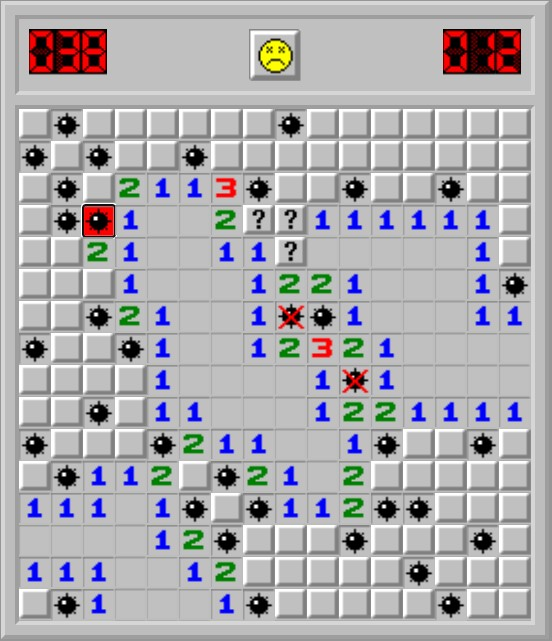

# Sapper

---

Стек:

- React 18.2.0
- TypeScript 4.9.5

---

[Играть](https://taashev.github.io/sapper-react/)

### Принцип игры

Целью игры является открытие всех ячеек, не содержащих мины.
Игрок открывает ячейки, стараясь не открыть ячейку с миной. Открыв ячейку с миной, он проигрывает.
Мины расставляются после первого хода, поэтому в новых версиях проиграть на первом же ходу невозможно.

Поле имеет размер 16х16.

Слева счетчик мин от 40 до 0.

Справа секундомер.

Левый клик мыши открывает ячейку.

Если рядом с открытым полем есть другие поля без мин поблизости, они открываются автоматически.

Правый клик мыши ставит флажок - так отмечается место, где предпологается мина.

Правый клик мыши по флажку, ставит знак вопроса, еще раз - выделение снимается.

Клик по смайлику перезапускает игру.

---

Как запустить:

- клонировать локально репозиторий
- установить зависимости командой "npm i"
- запустить команду "npm run start"
